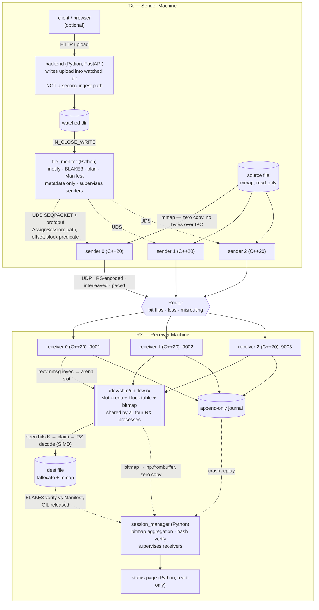
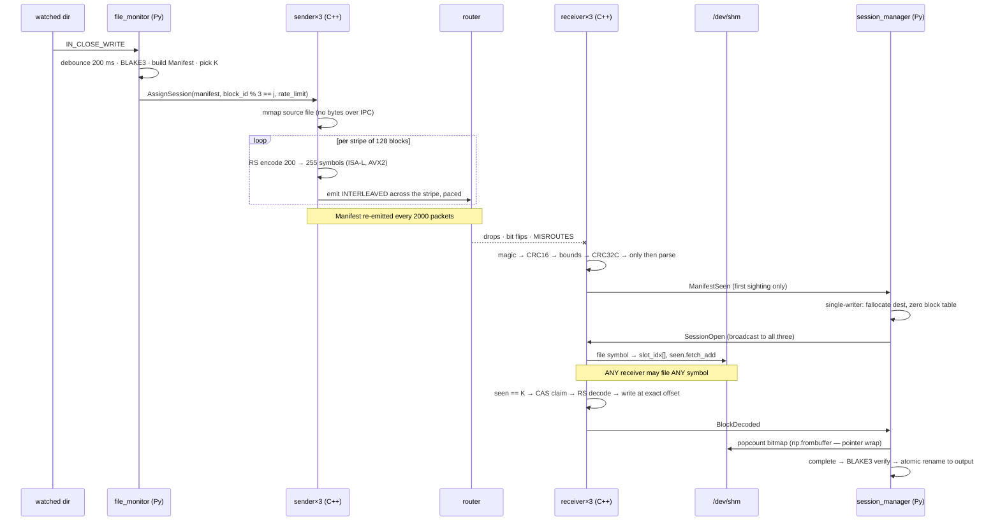

# Uniflow

**Reliable file distribution over a strictly unidirectional link.**

Triplet track — 8 processes, Reed–Solomon FEC, zero-copy data plane, Python control plane.

> **Status: design phase.** This document is the frozen architecture and team contract.
> Implementation has not started. Sections marked *(target)* describe the intended
> runtime behaviour and will become accurate as the code lands.

---

## תקציר (Hebrew abstract)

מערכת להפצת קבצים בין שני מחשבים פיזיים דרך תווך **חד-כיווני לחלוטין** — ללא ACK, ללא בקשות שידור
חוזר, וללא כל ערוץ חזרה מהיעד אל המקור. הנתב בדרך מחולל אובדן חבילות, שיבושי ביט וניתוב שגוי.

הרעיון המרכזי: **להמיר כל מצב כשל לסוג אחיד אחד — מחיקה (erasure) — ואז לפתור מחיקות בעזרת קוד תיקון
שגיאות.** אובדן חבילה, שיבוש ביט, ניתוב שגוי ואפילו קריסת תהליך שידור — כולם הופכים לאותה בעיה, ובעיה
זו נפתרת ע"י Reed–Solomon עם שזירה (interleaving).

המערכת מורכבת מ-8 תהליכים: בצד המקור (TX) תהליך `file_monitor` ב-Python ושלושה `sender` ב-++C;
בצד היעד (RX) שלושה `receiver` ב-++C ותהליך `session_manager` ב-Python. תעבורת המידע לעולם אינה
עוברת דרך Python — לא בצד המקור ולא בצד היעד. כלל ההודעות ברשת וב-IPC מקודדות ב-Protobuf,
ותקשורת פנים-מחשבית מתבצעת ב-Unix Domain Sockets.

---

## Table of contents

1. [The design thesis](#1-the-design-thesis)
2. [Quick start](#2-quick-start)
3. [Process roster](#3-process-roster)
4. [Architecture diagrams](#4-architecture-diagrams)
5. [Service specifications](#5-service-specifications)
6. [Wire protocol](#6-wire-protocol)
7. [IPC contracts](#7-ipc-contracts)
8. [Shared memory layout](#8-shared-memory-layout)
9. [Forward error correction](#9-forward-error-correction)
10. [Dynamic pacing](#10-dynamic-pacing)
11. [Supervision and crash recovery](#11-supervision-and-crash-recovery)
12. [Configuration reference](#12-configuration-reference)
13. [Sizing math](#13-sizing-math)
14. [Failure mode analysis](#14-failure-mode-analysis)
15. [Testing harness](#15-testing-harness)
16. [Rejected alternatives](#16-rejected-alternatives)
17. [Honest limits](#17-honest-limits)
18. [Team split and 14-day plan](#18-team-split-and-14-day-plan)
19. [Self-study topics](#19-self-study-topics)

---

## 1. The design thesis

The project brief gives one constraint that overrides every other design consideration:

> **The channel is strictly unidirectional. No ACK, no NACK, no retransmit request.**

Two consequences follow, and every decision in this document is downstream of them.

### 1.1 Reliable delivery is mathematically impossible here

You cannot *guarantee* that a 1 GB file arrives. You can only drive the failure
probability arbitrarily low by spending bandwidth on redundancy. Any system that claims
"zero-downtime, self-healing" on a diode link is misrepresenting itself.

What Uniflow guarantees instead:

1. Failure probability is a **tunable number**, set by the code rate `K/N` and the
   interleaving depth.
2. Every failure mode is converted into a **uniform erasure**, and erasures are solved by
   coding.
3. The system **always knows and reports** whether it succeeded, and names exactly which
   blocks failed.

### 1.2 One mechanism, four failure modes

This is the whole design in one table. It is the thing to explain first in a defense.

| Failure injected by the router | Converted into | Solved by |
|---|---|---|
| Packet loss | erasure | Reed–Solomon (any `K` of `N`) |
| Bit flip | detected by CRC32C → dropped → erasure | Reed–Solomon |
| Burst loss | spread across many blocks | **interleaving**, then Reed–Solomon |
| Packet misrouting | *nothing* — receivers own nothing | stateless receiver design |
| Sender process crash | partial erasure | cross-shard repair symbols |

Misrouting is the interesting one: it costs **zero** in this architecture. Not a
retransmit, not a forward, not even a `memcpy`. See [§5.3](#53-receiver-c20-rx-3).

---

## 2. Quick start

*(target — two commands, one per machine)*

### 2.1 Prerequisites

| Dependency | Purpose | Install |
|---|---|---|
| CMake ≥ 3.20, GCC ≥ 11 / Clang ≥ 14 | C++20 build | `apt install cmake g++` |
| Protobuf ≥ 3.21 (`libprotobuf-dev`, `protobuf-compiler`) | serialization | `apt install libprotobuf-dev protobuf-compiler` |
| Intel ISA-L (`libisal-dev`) | Reed–Solomon over GF(2⁸), AVX2 | `apt install libisal-dev` |
| BLAKE3 (`libblake3`) | integrity hashing | build from source, pin the version |
| Python ≥ 3.11 | control plane | — |
| `pybind11`, `protobuf`, `inotify_simple`, `numpy`, `fastapi` | Python deps | `pip install -r requirements.txt` |
| `iproute2` (`tc`) | test harness | `apt install iproute2` |

### 2.2 Build

```bash
git clone <repo> uniflow && cd uniflow
cmake -B build -DCMAKE_BUILD_TYPE=Release
cmake --build build -j
pip install -r requirements.txt
python -m pip install -e ./python   # builds the pybind11 module
```

### 2.3 Calibrate the link (once, before a demo run)

Measures true end-to-end capacity and baseline loss, then writes `link_profile.json`.
This is a **separate tool** that uses the out-of-band management path (SSH). The graded
transfer never touches it. See [§10.3](#103-tier-1-boot-time-calibration).

```bash
# On RX
./build/uniflow-calibrate --role rx --listen 0.0.0.0:9101

# On TX
./build/uniflow-calibrate --role tx --peer <RX_IP>:9101 --out config/link_profile.json
```

### 2.4 Run

```bash
# On the receiving machine
sudo ./scripts/run_rx.sh                 # starts session_manager + 3 receivers

# On the sending machine
sudo ./scripts/run_tx.sh                 # starts file_monitor + 3 senders
```

`sudo` is needed only to raise `net.core.rmem_max` and socket buffer limits. The
supervisors drop privileges immediately afterwards.

### 2.5 Usage examples

```bash
# Transfer a file: just drop it in the watched directory.
cp bigfile.iso /var/uniflow/watch/

# Watch progress on RX.
tail -f /var/log/uniflow/session_manager.log

# Output appears here only after the BLAKE3 hash verifies.
ls /var/uniflow/out/

# Change the send rate mid-run, no restart (hot reload, applies within ~50 ms).
sed -i 's/rate_ceiling_bps = .*/rate_ceiling_bps = 40_000_000/' config/uniflow.toml

# Optional demo surface.
curl -F 'file=@bigfile.iso' http://<TX_IP>:8080/upload
xdg-open http://<RX_IP>:8081/status
```

**Expected output on success:**

```
[session_manager] session 8f3a… OPEN     file=bigfile.iso size=1073741824 blocks=3835 K=200 N=255
[session_manager] session 8f3a… PROGRESS 1204/3835 (31.4%)  loss=4.1%  crc_fail=812  dup=19340
[session_manager] session 8f3a… PROGRESS 3835/3835 (100%)   loss=4.3%  arena_high_water=61%
[session_manager] session 8f3a… VERIFIED blake3=a91c…  → /var/uniflow/out/bigfile.iso
```

**Expected output on unrecoverable failure** — note that it names the dead blocks:

```
[session_manager] session 8f3a… STALLED  3801/3835 after 8.0s of no progress
[session_manager] session 8f3a… FAILED   undecodable blocks: 217, 1044, 1045, … (34 total)
[session_manager] session 8f3a… no back channel exists; recovery requires an out-of-band re-send
```

---

## 3. Process roster

Eight processes. **Not six** — the triplet track is 4 on each side.

| # | Process | Machine | Language | Count | Touches payload bytes? |
|---|---|---|---|---|---|
| 1 | `file_monitor` | TX | **Python** | 1 | No — metadata only |
| 2–4 | `sender` | TX | **C++20** | 3 | Yes (`mmap`) |
| 5–7 | `receiver` | RX | **C++20** | 3 | Yes (`recvmmsg` → shm) |
| 8 | `session_manager` | RX | **Python** | 1 | **No** — bitmaps only |
| — | `backend` | TX | Python | 1, optional | No |
| — | `status_ui` | RX | Python | 1, optional | No |

This satisfies the brief's "≥1 Python process and ≥1 C++ process per machine" honestly
rather than decoratively:

> **The 1 GB payload never crosses the Python boundary, on either machine.**

That single sentence is the strongest claim in the design. The `session_manager` is
responsible per the brief for aggregating status from all three receivers — it aggregates
**bitmaps**, not data. Its entire authoritative view of a 1 GB transfer is 480 bytes.

---

## 4. Architecture diagrams

### 4.1 Component and data flow



### 4.2 End-to-end sequence, large file



### 4.3 Trace of one symbol

`IN_CLOSE_WRITE` → `file_monitor` hashes and plans → `AssignSession` over UDS to Sender 1
→ Sender 1 reads the symbol from its `mmap` → RS-encodes the block → frames as
`[prefix | CRC32C][protobuf DataPacket]` → the token bucket admits it → `sendmmsg` → the
router flips a bit in a *different* packet and **misroutes this one to Receiver 2** →
Receiver 2's `recvmmsg` lands it directly in arena slot 8817 → CRC32C passes → parse →
`present_mask.fetch_or` says it is not a duplicate → `slot_idx[symbol_id] = 8817` →
`seen.fetch_add` returns 199, not `K`, so no decode yet → 40 ms later **Receiver 0** files
the 200th symbol, wins the CAS, RS-decodes the block, writes 280 KB into the `mmap`ed
destination at its exact offset, journals it → `session_manager` sees the bitmap bit flip
on its next 50 ms poll.

Note what did **not** happen: no copy of the payload, no cross-receiver message, no
correction for the misroute.

---

## 5. Service specifications

### 5.1 `file_monitor` (Python, TX, ×1)

Planner, dispatcher, and TX supervisor. Owns every TX-side decision.

**Purpose** — notice files, plan their transfer, hand plans to senders, aggregate TX status.

**Inputs** — inotify events on the watched directory; UDS connections from senders;
`link_profile.json`; `uniflow.toml`.

**Outputs** — `AssignSession` / `UpdateRate` / `Abort` over UDS; TX status log.

**State it owns** — the session registry: for each active session, the file path, size,
hash, block count, sender→block assignment, and per-sender progress.

**Sequence:**

1. Debounce the inotify event with a 200 ms quiet period. Watch `IN_CLOSE_WRITE` and
   `IN_MOVED_TO` — **not** `IN_CREATE`, which fires before the file is fully written.
2. Stat the file and compute its BLAKE3 hash. This is the one CPU-heavy thing Python does;
   it runs on an executor with the GIL released. It *reads* the file but never sends its
   bytes anywhere.
3. Build the **Manifest**: `session_id`, `relpath`, `file_size`, `hash`, `K`, `N`,
   `symbol_bytes`, `total_blocks`, `tx_rate_bps`.
4. Choose `K` from the loss→K table using the measured loss in `link_profile.json`
   ([§9.3](#93-choosing-k)).
5. Route. **Small file (<10 MB)** → assign the whole file to the least-loaded sender.
   **Large file** → shard across all three: sender *j* takes blocks where
   `block_id % 3 == j`.
6. Send `AssignSession` with the manifest, the source path, and the block predicate.
7. Track `SenderProgress`; log completion; re-plan if a sender dies.

**Explicitly does not** — read file bytes into a message, touch the network, encode
anything, or hold payload in memory.

### 5.2 `sender` (C++20, TX, ×3)

Pure data plane. Stateless between sessions, interchangeable, knows nothing about files it
was not assigned.

**Purpose** — turn an assigned block range into paced, RS-encoded, interleaved UDP
datagrams.

**Inputs** — `AssignSession` / `UpdateRate` over UDS; the source file via `mmap`
(read-only, `MADV_SEQUENTIAL`).

**Outputs** — UDP datagrams to the router; `SenderProgress` / `LocalCongestion` /
`SessionComplete` / `Heartbeat` over UDS.

**Threads** — two. An encode/send thread and a control thread. Do not add more; a single
send thread at ~18k pps is not the bottleneck.

**Main loop, per stripe of `G = 128` blocks:**

1. Read the stripe's 128 × 280 KB straight out of the `mmap`.
2. RS-encode each block to 255 symbols (ISA-L, AVX2 GF multiply). This is the SIMD hot
   path and the only place vectorization genuinely earns its place.
3. **Emit interleaved** — `for s in 0..254: for b in stripe: emit(b, s)`. Never
   block-by-block. See [§9.2](#92-interleaving-the-single-most-important-detail).
4. Every 2000 packets, splice in a Manifest copy.
5. Request a token from the pacer before each `sendmmsg` batch; sleep when empty.
6. Advance, report progress, apply any pending `UpdateRate` at the stripe boundary.

**On finish** — emit `SessionEnd` ×20, report `SessionComplete`.

**Explicitly does not** — hash, decide routing, retry, wait for anything from RX (there is
no RX→TX path), or read blocks outside its shard.

### 5.3 `receiver` (C++20, RX, ×3)

**Stateless and interchangeable. This is the entire answer to packet misrouting.**

**Purpose** — get datagrams off the wire into shared memory with zero copies, decode
blocks that reach `K`, write to disk.

**Inputs** — UDP on its own port; `Config` / `SessionOpen` / `PurgeSession` over UDS.

**Outputs** — decoded bytes written to the destination file at exact offsets;
`ManifestSeen` / `BlockDecoded` / `ReceiverStats` / `Heartbeat` over UDS; journal appends.

**Threads** — two. A receive thread that does **nothing but** `recvmmsg` (a blocked
receive thread is a silent kernel drop), and a decode/write thread fed by an SPSC ring of
slot indices.

**Receive thread:**

1. Pre-arm a batch of 64 arena slots and point the `iovec`s directly at them, so the
   kernel writes each datagram into its **final resting place**.
2. `recvmmsg(MSG_DONTWAIT)`.
3. Per datagram: check magic → CRC16 over the prefix → bounds-check `proto_len` →
   **CRC32C over the body → only then parse protobuf**. Any failure is a drop, which is an
   erasure, which is the FEC layer's problem.
4. Manifest for an unknown session → forward `ManifestSeen` to the manager, release slot.
5. Data → file `(block_id, symbol_id) → slot_index` into the shared block table.
   Duplicate → release slot. If this filing brought the block to `K` → push onto the ring.

**Decode/write thread** — CAS-claim the block, RS-decode from the 200 slots, write into the
`mmap`ed destination at `block_id × K × symbol_bytes`, append to the journal, release all
slots, notify the manager.

**Explicitly does not** — own a session, own a shard, check whether a packet "was for it",
talk to another receiver, or verify the file hash.

> **Why misrouting is free.** Every `DataPacket` is fully self-describing
> (`session_id`, `block_id`, `symbol_id`), and all three receivers write into **one**
> shared arena and block table. No receiver owns a session, a shard, or a port→block
> mapping. A receiver that gets a packet "meant for" another simply files it like any
> other packet. Decoding is claimed by whichever process happens to drive a block's
> counter to `K`, via one atomic `fetch_add`. Total cost of misrouting: one cache line of
> contention. The mentors' misrouting script is untestable against this design.

### 5.4 `session_manager` (Python, RX, ×1)

The reassembly authority and RX supervisor. Per the brief: *"centralizes reports from all
receive processes, unifies the information, and presents status."*

**Purpose** — create sessions, aggregate three receivers into one truth, verify integrity,
report, supervise.

**Inputs** — UDS from all three receivers; read-only `mmap` of the RX shared segment.

**Outputs** — `SessionOpen` broadcasts; status API and log; final `VERIFIED` /
`HASH_MISMATCH` / `INCOMPLETE` verdict; published output files.

**State it owns (sole writer)** — the session table in shm.

**Loop:**

1. On the first `ManifestSeen` for a session — validate it, `fallocate` and create the
   destination in `.partial/`, zero a block table and bitmap in shm, broadcast
   `SessionOpen` to all three receivers. **Single-writer session creation**, so there is no
   race between the three receivers.
2. Every 50 ms — wrap the completion bitmap with `np.frombuffer` (a pointer wrap over
   receiver memory: no copy, no serialization) and popcount it.
3. Complete → BLAKE3-verify the destination against the manifest on an executor with the
   GIL released, then atomically `rename` into the output directory.
4. No forward progress for 8 s → declare failure and **name the specific undecodable
   blocks**. Do not publish.
5. Aggregate per-receiver counters (CRC failures, kernel drops, arena exhaustion,
   duplicates, per-stripe loss %) into one status view.

**Explicitly does not** — touch payload bytes, receive from the network, or decode.

> **Why it never sees payload.** The brief puts the session manager in the *reporting*
> path. Routing a gigabyte through a Python process because a box on a diagram has an
> arrow through it would be the single worst decision available. It gets bitmaps.

### 5.5 `backend` / `status_ui` (Python, optional)

Deliberate scope overkill, kept as a demo surface and fenced hard.

**In scope** — a FastAPI upload endpoint on TX that writes into the watched directory and
returns; a read-only status page on RX rendering the session manager's existing status.

**Out of scope, non-negotiable:**

- Never a second ingest path. inotify stays the single source of truth, so there is exactly
  one code path to test against the router.
- Never handles payload bytes beyond writing the upload to disk.
- Never talks to senders or receivers directly.
- No auth, no database, no users.

**Scheduled day 13–14, after the router test passes. This is the designated cut line.**

---

## 6. Wire protocol

### 6.1 Frame layout

Every datagram is a 12-byte fixed prefix followed by a protobuf body.

```
 0                   1                   2                   3
 0 1 2 3 4 5 6 7 8 9 0 1 2 3 4 5 6 7 8 9 0 1 2 3 4 5 6 7 8 9 0 1
+-+-+-+-+-+-+-+-+-+-+-+-+-+-+-+-+-+-+-+-+-+-+-+-+-+-+-+-+-+-+-+-+
|                       magic  ('UNIF')                         |
+-+-+-+-+-+-+-+-+-+-+-+-+-+-+-+-+-+-+-+-+-+-+-+-+-+-+-+-+-+-+-+-+
|         proto_len (u16)       |        hdr_crc (CRC16)        |
+-+-+-+-+-+-+-+-+-+-+-+-+-+-+-+-+-+-+-+-+-+-+-+-+-+-+-+-+-+-+-+-+
|                    body_crc (CRC32C, hardware)                |
+-+-+-+-+-+-+-+-+-+-+-+-+-+-+-+-+-+-+-+-+-+-+-+-+-+-+-+-+-+-+-+-+
|                   protobuf body (proto_len bytes)             |
|                              ...                              |
+-+-+-+-+-+-+-+-+-+-+-+-+-+-+-+-+-+-+-+-+-+-+-+-+-+-+-+-+-+-+-+-+
```

| Field | Size | Purpose |
|---|---|---|
| `magic` | 4 B | reject foreign or stale traffic instantly |
| `proto_len` | 2 B | body length |
| `hdr_crc` | 2 B | CRC16 over the preceding 8 bytes — makes `proto_len` trustworthy **before** it is used |
| `body_crc` | 4 B | CRC32C via `_mm_crc32_u64` — detects bit flips before protobuf sees the bytes |

### 6.2 Why the prefix is not optional

The brief mandates Protobuf everywhere. Protobuf is unsafe on corrupted input in two
specific ways:

1. A flipped bit inside a varint length header becomes a **multi-gigabyte allocation
   request**.
2. A flipped bit in `session_id` files a **valid-looking symbol into the wrong session**,
   silently poisoning a decode that would otherwise have succeeded. This is *worse* than
   losing the packet.

The UDP checksum is only 16 bits, so roughly 1 in 65,536 corrupt datagrams arrives looking
clean. Over 978,000 packets that is **~14 poisoned frames per 1 GB transfer**. CRC32C
closes the gap.

> **Invariant: verify CRC, then parse. Never the reverse.**

Defense in depth on the parser: `SetTotalBytesLimit` and arena allocation on the C++ side.

### 6.3 Network messages (TX → RX, one-way, no replies ever)

| Message | Key fields | Frequency per 1 GB |
|---|---|---|
| `Manifest` | session_id, relpath, file_size, hash(32), K, N, symbol_bytes, total_blocks, sender_id, tx_rate_bps | ×5 at open, every 2000 pkts, ×5 at close |
| `DataPacket` | session_id, block_id, symbol_id, payload(≤1400) | 977,925 |
| `SessionEnd` | session_id, total_blocks, hash | ×20 at close |
| `TreeSnapshot` | group_id, repeated DirEntry{relpath, is_dir} | ×5, optional |
| `RateLadderMark` | rung_index, rate_bps | calibration mode only |

**Metadata gets 100× the redundancy of data.** The Manifest is the only true single point
of failure — lose that one packet and a gigabyte of perfectly received symbols is
undecodable garbage. At ~200 bytes against 1.41 GB, re-emitting it every 2000 packets from
all three senders is free, and it converts the worst failure mode in the design into a
non-event.

Generalized rule: **in a feedback-free system, allocate redundancy in proportion to blast
radius, not data volume.**

---

## 7. IPC contracts

Unix Domain Sockets, `SOCK_SEQPACKET`, Protobuf bodies.

Two rules:

1. **Use `SOCK_SEQPACKET`, not `SOCK_STREAM`.** It preserves message boundaries, so you do
   not hand-roll length framing for every message. Fewer bugs, less code.
2. **Descriptors, never bytes.** `AssignSession` carries a *path plus a block predicate*.
   Each sender `mmap`s the source file itself. File bytes never enter an IPC message.

### 7.1 TX — `/run/uniflow/tx/monitor.sock` (`file_monitor` is server)

| Dir | Message | Fields |
|---|---|---|
| S→M | `Hello` | sender_id, pid, version, **proto_hash** |
| M→S | `AssignSession` | Manifest, source_path, block_modulus, block_residue, target_host, target_port, rate_limit_bps |
| M→S | `UpdateRate` | rate_bps — applied at the next stripe boundary |
| M→S | `Abort` | session_id |
| S→M | `SenderProgress` | session_id, stripes_done, packets_sent, bytes_sent |
| S→M | `LocalCongestion` | enobufs_count, qdisc_drops, current_rate_bps |
| S→M | `SessionComplete` | session_id, packets_sent |
| S→M | `Heartbeat` | sender_id, timestamp |

### 7.2 RX — `/run/uniflow/rx/manager.sock` (`session_manager` is server)

| Dir | Message | Fields |
|---|---|---|
| R→M | `Hello` | receiver_id, pid, port, version, **proto_hash** |
| M→R | `Config` | shm_name, staging_dir, output_dir |
| R→M | `ManifestSeen` | Manifest (verbatim, as received) |
| M→R | `SessionOpen` | session_id, block_table_offset, bitmap_offset, dest_path, total_blocks |
| R→M | `BlockDecoded` | session_id, block_id |
| R→M | `ReceiverStats` | receiver_id, pkts_ok, crc_fail, dup, no_session, arena_exhausted, kernel_drops |
| M→R | `PurgeSession` | session_id |
| R→M | `Heartbeat` | receiver_id, timestamp |

**`proto_hash` in `Hello` is load-bearing.** The supervisor compares it against its own and
kills the tree on mismatch. This catches "someone regenerated the protobuf and didn't
rebuild" in one second instead of two hours.

---

## 8. Shared memory layout

One segment, `/dev/shm/uniflow.rx`, mapped by all four RX processes. Receivers read and
write; the session manager maps read-only except for the session table.

```
┌────────────────────────────────────────────────────────────────┐
│ Header (1 page)                                                │
│   magic · version · boot_id · owner_pid                         │
│   slot_size · slot_count · free_list_head (atomic u64 w/ gen)   │
├────────────────────────────────────────────────────────────────┤
│ Session table — 8 fixed entries                                │
│   session_id · state · K · N · symbol_bytes · file_size         │
│   hash[32] · dest_path[256] · block_table_off · bitmap_off      │
│   SOLE WRITER: session_manager                                  │
├────────────────────────────────────────────────────────────────┤
│ Block table — one entry per block, ~1088 B each                │
│   present_mask[4 × u64]   duplicate suppression                 │
│   seen      (atomic u32)  fetch_add; whoever hits K decodes     │
│   decoded   (atomic u32)  CAS latch, idempotent completion      │
│   slot_idx[255]           an INDEX, not a copy                  │
│   3835 blocks → 4.2 MB.  Writers: all three receivers           │
├────────────────────────────────────────────────────────────────┤
│ Completion bitmap — 1 bit per block → 480 B for a 1 GB file    │
│   The session manager's ENTIRE authoritative view               │
├────────────────────────────────────────────────────────────────┤
│ Slot arena — 1536 B slots · ~174,000 slots in 256 MB           │
│   The kernel DMAs datagrams directly here via recvmmsg iovec    │
│   Lock-free MPMC free list, 32-bit generation counter vs. ABA   │
└────────────────────────────────────────────────────────────────┘
```

> **Total user-space copies of a payload byte, wire to disk: zero.** The kernel writes into
> a slot; filing a symbol is an index assignment; RS-decode writes into a `mmap`ed
> destination file at its exact offset.

**Arena exhaustion is a legitimate signal, not an error.** When `acquire()` returns `kNil`
the decode path is behind the wire, so the receiver drops the packet deliberately. That
drop is just another erasure, and the FEC budget has already been paid for it. Emit a
back-pressure metric and continue.

---

## 9. Forward error correction

### 9.1 Reed–Solomon over GF(2⁸)

Each block of `K = 200` source symbols is encoded to `N = 255` symbols using Reed–Solomon
(Intel ISA-L, AVX2 GF matrix multiply). **Any 200 of the 255 reconstruct the block.** That
is 27.5% bandwidth overhead in exchange for tolerating 55 lost symbols (21.6%) per block.

This is where SIMD is earned rather than bolted on: GF(2⁸) multiply-accumulate over
1400-byte symbols is a genuinely vectorizable inner loop, and ISA-L's AVX2 path runs it at
several GB/s. `consteval` generates the GF log/exp tables and frame field offsets at
compile time — honestly, that saves microseconds of startup, not hot-path time. Do not
claim template metaprogramming is producing your throughput.

### 9.2 Interleaving — the single most important detail

Transmit **interleaved across blocks**, never block-by-block. Sender *j* processes its
blocks in stripes of `G = 128`:

```
for stripe in sender_blocks chunked by 128:
    encode all 128 blocks → 128 × 255 symbols     (45.7 MB buffer)
    for s in 0..254:
        for b in stripe:
            emit DataPacket(b, s)
```

Router loss is **bursty** — a 60-packet loss is one queue drain, not 60 independent events.

- Sequential transmission puts all 60 losses in **one block** and kills it.
- Interleaved transmission costs **one symbol from each of 60 different blocks**, which RS
  absorbs without noticing.

Interleaving depth is the difference between a system that works and one that fails at 2%
loss.

### 9.3 Choosing K

With interleaving, per-block losses are approximately binomial(255, p) and the block dies
above 55 lost. `K = 200` is comfortable to ~12% loss and falls off a cliff by 15%:

| Router loss `p` | Mean lost/block | σ | Margin to 55 | Expected dead blocks (of 3,835) |
|---|---|---|---|---|
| 5% | 12.8 | 3.5 | 12σ | ~0 |
| 10% | 25.5 | 4.8 | 6.1σ | ~0.00001 |
| 13% | 33.2 | 5.4 | 4.0σ | ~0.1 |
| **15%** | 38.3 | 5.7 | 2.9σ | **~7 — fails** |
| 20% | 51.0 | 6.4 | 0.6σ | ~1000 — dead |

So `K` is a **config value, never a hardcoded constant.** Measure the router on day 11,
then select from this table with ≥4σ of margin:

| Measured loss | K | Overhead | Loss tolerated |
|---|---|---|---|
| < 5% | 200 | 27.5% | 21.6% |
| 5–10% | 180 | 42% | 29.4% |
| 10–15% | 160 | 59% | 37.3% |
| 15–25% | 128 | 99% | 49.8% |
| > 25% | 100 | 155% | 60.8% |

`K` may change between sessions but **never within one** — it is in the Manifest and RX
needs it to decode.

### 9.4 Second dimension: XOR parity across block groups

One XOR parity block per group of 16 blocks. +6.25% overhead, ~30 lines of code, and it
recovers any single completely-dead block in a group. This covers exactly the tail case RS
cannot: a loss burst longer than the interleaving depth.

### 9.5 Sender-crash tolerance (optional tier)

Each sender owns a disjoint block set but *additionally* emits ~10% of the repair symbols
for its neighbours' blocks. It already has the whole file `mmap`ed, so this costs CPU only.
Losing an entire sender process mid-flight becomes a survivable partial erasure instead of
"one third of the file is gone." **Implement only after the happy path is green.**

---

## 10. Dynamic pacing

Link speed is unknown and must be discovered at runtime.

### 10.1 The uncomfortable part first

Congestion control is a closed-loop algorithm. TCP, BBR, and QUIC all work by observing
what arrived at the receiver. **There is no return path here, so the loop cannot be
closed.** Any design claiming to auto-tune to the true bottleneck is lying somewhere.

What Uniflow builds instead is three loops that each close somewhere other than the
network:

| Tier | Loop closes via | Detects | Cost |
|---|---|---|---|
| 1. Boot calibration | out-of-band SSH | true end-to-end capacity | ~½ day, highest value |
| 2. TX-local AIMD | kernel signals on the sending host | local bottleneck only | ~½ day |
| 3. Human in the loop | operator reading the RX screen | anything, incl. router loss | ~2 h, best value/hour |

### 10.2 Day-3 experiment: is the link a real diode?

Send UDP to a closed port on RX and watch TX for ICMP port-unreachable.

- **ICMP comes back** → the link is unidirectional by *protocol convention*, not physically.
  Log it as a diagnostic and **do not build on it**. A mentor who sees ICMP used as an ACK
  channel will correctly say you dodged the assignment.
- **Nothing comes back** → it is a real diode and every word above applies.

### 10.3 Tier 1: boot-time calibration

The *data* path is one-way. The *management* path is not, since you have to log into both
machines to start anything. A separate tool using that path is legitimate as long as the
graded transfer never touches it.

1. Read NIC link speed via `ethtool` on both ends; ceiling = `min(tx, rx)`.
2. Send a **rate ladder** — ~2 s each at 10/20/40/60/80/100% of the ceiling, tagged with
   `RateLadderMark`.
3. RX counts arrivals per rung and reports the loss-vs-rate curve back over SSH.
4. Find the knee; write `link_profile.json`:
   `{measured_capacity_bps, knee_bps, measured_loss_at_knee, timestamp, path_id}`.
5. Operating ceiling = **60–70% of the knee**.

`file_monitor` loads this at startup. If the profile is missing or older than 24 h it
refuses to guess quietly: it logs loudly and falls back to 20 Mbit/s aggregate.

The same run yields the router's baseline loss rate, which is the input to
[§9.3](#93-choosing-k). Calibration feeds **both** knobs.

### 10.4 Tier 2: TX-local AIMD

Signals available on the sending host with no feedback:

| Signal | Source | Meaning |
|---|---|---|
| `ENOBUFS` / `EAGAIN` | `sendmmsg` return | qdisc / txqueue full — past local line rate |
| `SIOCOUTQ` | ioctl | send-buffer backlog growing |
| qdisc drops | netlink `TC_H_ROOT` stats | local shaping is dropping your packets |
| batch syscall duration | timing | rising = kernel pushing back |

Controller: token bucket, +5% per stripe when a stripe completes with zero congestion
signals, ×0.7 immediately on any signal, floor 5 Mbit/s, ceiling from the Tier-1 profile.
Each sender runs its own bucket at `ceiling / 3`.

> **Stated limitation.** These signals see only the *local* bottleneck. If the mentors'
> router is the narrow link — and it probably is, since it is deliberately degraded — TX
> sees a perfectly clean local path while packets die downstream. Tier 2 protects you from
> overrunning your own NIC. It cannot protect you from overrunning the router. Tier 1 does
> the real work; Tier 2 is a safety net.

### 10.5 Tier 3: hot reload plus a good status screen

The cheapest real feedback loop is a human.

- **TX** — `file_monitor` watches its own config file. Change `rate_ceiling_bps` and all
  three senders have it within one stripe (~50 ms) via `UpdateRate`. No restart, no
  re-send.
- **RX** — `session_manager` prints per-session live status: blocks decoded / total,
  **per-stripe loss %**, CRC failures, duplicates, arena exhaustion, kernel drops.

During the demo you watch RX, see loss climb past ~12%, type a lower number on TX, watch it
drop. That is a closed loop with a human as the return path, and it will find the right
rate faster than anything you could automate in fourteen days.

Because packets carry `block_id` and senders emit stripes in order, RX can attribute loss
to a time window and therefore to a rate. Ramp the rate slowly across the first few stripes
and the RX screen shows you the knee **during the graded run**.

### 10.6 OS knobs

Set these in `run_tx.sh` / `run_rx.sh` or the whole thing underperforms:

```bash
sysctl -w net.core.rmem_max=33554432
sysctl -w net.core.wmem_max=33554432
sysctl -w net.core.netdev_max_backlog=5000
# plus SO_RCVBUF / SO_SNDBUF of several MB on every socket
```

---

## 11. Supervision and crash recovery

Symmetric: each side's Python process supervises that side's C++ processes. No new process
types.

```
run_rx.sh                         run_tx.sh
  └── session_manager (Python)      └── file_monitor (Python)
        ├── receiver 0  :9001             ├── sender 0
        ├── receiver 1  :9002             ├── sender 1
        └── receiver 2  :9003             └── sender 2
```

### 11.1 Boot sequence (RX) — order matters

1. Acquire a PID lock (`flock` on `/run/uniflow/rx.lock`). **Two supervisors on one shm
   segment is the worst bug in this project; make it impossible.**
2. **Create and initialize the shm segment** — must happen before any receiver starts,
   since receivers attach rather than create.
3. Bind the UDS listener.
4. `fork`/`exec` three receivers with `--id N --port 900N --shm /uniflow.rx --sock …`.
5. Each sends `Hello` with `proto_hash`. **Verify it matches.** Mismatch → kill the tree and
   exit with a clear error.
6. Send `Config` to each; enter the normal loop.

TX is the same shape: lock → UDS listener → spawn three senders → `Hello` + proto check →
load `link_profile.json` → start inotify.

### 11.2 Health and restart

- Heartbeat every 1 s over the existing UDS. Three consecutive misses, or a `SIGCHLD`,
  triggers restart.
- Exponential backoff — 1, 2, 4, 8, 16, cap 30 s. Five deaths in 60 s → stop restarting and
  report `DEGRADED`. A crash loop should be visible, not hidden.
- **Receiver restart is nearly free** — the payoff from the stateless design. The new
  process attaches the existing shm, replays its journal, re-registers, and resumes
  ingesting. In-flight sessions are unaffected because it owned nothing, and the other two
  receivers were already accepting all traffic during the gap.
- **Sender restart is not free.** Blocks it was mid-stripe on are lost with no way to know
  which arrived. The monitor re-plans the dead sender's remaining blocks across the
  survivors and lets FEC cover the seam. Log it as a partial-integrity event.

### 11.3 Pitfall: do not zero shm on manager restart

If `session_manager` crashes while receivers are alive and healthy, the restarted manager
**must attach the existing segment, not reinitialize it**. Receivers are holding slot
indices and block tables; zeroing that memory corrupts three live processes.

Rule:

- The header carries `magic`, `version`, `boot_id`, `owner_pid`.
- On start, try to attach. If the segment exists with matching magic/version **and any
  receiver answers a ping**, adopt it and rebuild the bitmap view from the block tables plus
  the receivers' journals.
- Reinitialize only when no receivers are alive, or on explicit `--fresh`.
- On clean shutdown, `shm_unlink` and remove the UDS paths.

### 11.4 Supervision must not block on hashing

`session_manager` is both the supervisor and the process that BLAKE3-verifies a 1 GB file.
If hashing runs on the event loop, children go unreaped for ~300 ms at exactly the moment a
transfer completes. Hashing goes to a `ThreadPoolExecutor` with the GIL released inside the
C++ binding; supervision lives in its own `asyncio` task. **Do not lose this property during
implementation.**

### 11.5 The one piece of event sourcing worth keeping

Each receiver appends `{session, block, symbol_range, file_offset}` records to a
per-process append-only journal, `fdatasync`ed in batches. If a receiver or the manager
dies mid-transfer, restart replays the journal to rebuild the completion bitmap in
milliseconds instead of re-hashing a gigabyte. Replay is safe because destination writes are
idempotent — fixed offset, fixed content.

This is the entire WAL. No distributed database, no event bus, no CQRS.

### 11.6 BLAKE3 note

TX hashes in Python, RX verifies in C++. Two different BLAKE3 implementations (the
Rust-backed PyPI wheel vs. the official C library) both produce correct output, so this is
fine — but **pin both versions and cross-verify on day 2** with a known test vector. A hash
mismatch discovered on day 12 with no known-good baseline is a miserable afternoon.

Cleanest option: bind the official C `libblake3` through the existing Pybind11 module and
use it on both sides. One implementation, one version, no ambiguity, ~10 lines.

---

## 12. Configuration reference

`config/uniflow.toml`, read by all eight processes. **Freeze on day 1.** Every number is
load-bearing; changing one after day 3 means re-testing everything.

```toml
[wire]
symbol_bytes          = 1400    # 1500 MTU - 20 IP - 8 UDP = 1472 usable;
                                # 1400 + 12 prefix + ~30 protobuf = 1442. Never fragments.
magic                 = "UNIF"

[fec]
k                     = 200     # source symbols per block → 280 KB blocks
n                     = 255     # GF(2^8) hard ceiling; 27.5% overhead, 21.6% loss tolerated
interleave_stripe     = 128     # blocks per stripe — absorbs bursts up to 128 packets
xor_group             = 16      # one XOR parity block per 16 blocks (+6.25%)
k_selection_table     = "config/k_table.toml"   # loss% → K, see §9.3

[session]
manifest_repeat_every = 2000    # packets — metadata gets 100x the redundancy of data
session_id_bytes      = 16      # random; stops stale packets poisoning a new run
small_file_threshold  = 10_000_000
max_file_size         = 1_000_000_000
hash                  = "blake3"
stall_timeout_s       = 8.0

[net]
rx_ports              = [9001, 9002, 9003]
recv_batch            = 64      # recvmmsg batch size
so_rcvbuf             = 8_388_608
so_sndbuf             = 8_388_608

[pacing]
rate_ceiling_bps      = 0       # 0 = load from link_profile.json; hot-reloadable
rate_floor_bps        = 5_000_000
aimd_increase_pct     = 5
aimd_decrease_factor  = 0.7
profile_max_age_hours = 24
fallback_rate_bps     = 20_000_000

[shm]
name                  = "/uniflow.rx"
arena_bytes           = 268_435_456     # 256 MB → ~174,000 slots
slot_bytes            = 1536

[supervision]
heartbeat_interval_s  = 1
missed_heartbeats     = 3
restart_backoff_s     = [1, 2, 4, 8, 16, 30]
crashloop_threshold   = 5       # deaths within 60 s → DEGRADED

[paths]
watch_dir             = "/var/uniflow/watch"
staging_dir           = "/var/uniflow/.partial"
output_dir            = "/var/uniflow/out"
journal_dir           = "/var/uniflow/journal"
tx_sock               = "/run/uniflow/tx/monitor.sock"
rx_sock               = "/run/uniflow/rx/manager.sock"
```

---

## 13. Sizing math

For a 1 GB file at `K = 200`, `N = 255`, `symbol_bytes = 1400`:

| Quantity | Value |
|---|---|
| Blocks | 3,835 |
| Packets on the wire | 977,925 |
| Wire bytes | ~1.41 GB (27.5% FEC overhead) |
| Sender encode buffer | 45.7 MB per sender (one stripe) |
| Blocks in flight at RX | ~384 (3 senders × 128) |
| Arena needed for that | ~150 MB → **allocate 256 MB** |
| Block table | 4.2 MB |
| **Session manager's authoritative state** | **480 bytes** |
| Transfer time @ 75 MB/s | ~19 s |
| Loss tolerated per block | 55 of 255 (21.6%) |

---

## 14. Failure mode analysis

| Failure | Detection | Response | Residual risk |
|---|---|---|---|
| **Bit flip in payload** | CRC32C over body | Drop → erasure → RS reconstructs from any 200/255 | Undetected corruption ~2⁻³² per frame |
| **Bit flip in header** | CRC16 on prefix + CRC32C before parse | Dropped before parse — no cross-session poisoning, no hostile allocation | As above |
| **Packet loss, random** | Absent bit in `present_mask` | RS decode at K=200; tolerates 21.6%/block | Loss above code rate → block dead |
| **Packet loss, bursty** | — | **Interleaving** spreads the burst across 128 blocks | Burst longer than interleave depth → XOR parity tier |
| **Packet misrouting** | Not detected, because not needed | Receivers own nothing; any process files any symbol | Cache-line contention only |
| **Manifest lost** | Symbols arrive for an unknown session | Re-emitted every 2000 packets from all three senders | Requires *all* copies lost |
| **Sender crash** | UDS peer loss / heartbeat | Cross-shard repair symbols cover the gap; monitor re-plans remaining blocks | Crash before any repair coverage |
| **Receiver crash** | UDS close / heartbeat | Other two keep ingesting **all** traffic — no shard was orphaned, because none was owned | Throughput drop → self-inflicted loss |
| **Session manager crash** | supervisor / `flock` | Attach (never re-zero) existing shm, replay journal, rebuild bitmap in ms | Unsynced journal tail replayed harmlessly |
| **Arena exhaustion** | `acquire()` returns `kNil` | Deliberate drop — just another erasure, already paid for. Emit back-pressure metric | Sustained overrun → loss above code rate |
| **Kernel rx-queue overrun** | `SO_RXQ_OVFL`, `/proc/net/udp` | Dedicated recv thread, `recvmmsg` batching, large `SO_RCVBUF`, lower pacing | Under-provisioned RX host |
| **Sender outruns the link** | RX loss far above injected rate | Tier-1 calibration, Tier-2 AIMD, Tier-3 hot reload | **Mis-tuned rate is the #1 practical failure** |
| **Hash mismatch** | BLAKE3 vs Manifest | Quarantine in `.partial/`, mark `HASH_MISMATCH`, **do not publish** | — |
| **Undecodable after stall** | No progress for 8 s | Fail loudly, name the missing blocks. **Cannot self-heal — no back channel exists.** Recovery is an out-of-band re-send | Inherent to the medium |

---

## 15. Testing harness

Test against your **own** impairment before you ever see the mentors' router.

```bash
# Add impairment on the TX egress interface (adjust dev name).
sudo tc qdisc add dev eth0 root netem \
     loss 5% \
     duplicate 1% \
     corrupt 0.1% \
     reorder 2% 50% \
     delay 20ms 5ms

# Burst loss — the case interleaving exists for.
sudo tc qdisc change dev eth0 root netem loss 12% 25%   # 25% correlation

# Rate limit, to reproduce a narrow router link.
sudo tc qdisc add dev eth0 root tbf rate 50mbit burst 32kbit latency 400ms

# Inspect and remove.
tc -s qdisc show dev eth0
sudo tc qdisc del dev eth0 root
```

**Misrouting test** — the design claim is that this is a no-op. Prove it: point all three
senders at a **single** RX port so every packet lands on the "wrong" receiver, and confirm
the transfer still completes and verifies.

**Test matrix:**

| Case | Setup | Pass criterion |
|---|---|---|
| Happy path | 1 MB, localhost, no impairment | hash verifies |
| Loss | 5%, 10%, 12% | hash verifies |
| Loss cliff | 15%, 20% | fails **cleanly**, names dead blocks |
| Burst loss | `loss 12% 25%` | hash verifies — proves interleaving works |
| Corruption | `corrupt 0.5%` | hash verifies; `crc_fail` counter non-zero |
| Misrouting | all traffic → one port | hash verifies, no behaviour change |
| Receiver kill | `kill -9` a receiver mid-transfer | restarts, transfer completes |
| Manager kill | `kill -9` the manager mid-transfer | attaches (not re-zeroes) shm, completes |
| Sender kill | `kill -9` a sender mid-transfer | fails cleanly or recovers via repair symbols |
| Scale | 1 GB across two physical machines | hash verifies within budget |
| Concurrency | 3 × 8 MB files simultaneously | all three verify |

---

## 16. Rejected alternatives

Documenting a rejection is worth more than a lucky default.

### 16.1 RaptorQ (RFC 6330) instead of Reed–Solomon

**Rejected**, with real reluctance. The argument *for* it is that rateless codes suit
unknown channels because you never commit to a code rate.

Why it shrinks here:

- **No feedback means you still must decide when to stop.** RaptorQ converts "guess the
  code rate" into "guess the transmission budget" — the same guess in a different hat.
  Ratelessness pays off when a receiver can say *stop*, and this channel cannot.
- **The loss rate is not actually unknown.** The mentors run a fixed script on a fixed
  router. It is a stationary, measurable property of the test environment.

Its genuine advantages, acknowledged: GF(2⁸) caps RS at `N ≤ 255`, and RS fails if *any
single block* exceeds threshold whereas RaptorQ fails only on aggregate deficit.

| | Reed–Solomon (ISA-L) | RaptorQ |
|---|---|---|
| Spec to implement | ~1 page of linear algebra | ~90 pages: LDPC + HDPC + LT layers, 477-entry systematic index table, permanent inactivation decoding |
| Library | `libisal` — Intel, BSD-3, in apt, AVX2/AVX-512 | `libRaptorQ` essentially the only option; needs Eigen, awkward API, **check the license** |
| Encode throughput | multiple GB/s | far lower, plus expensive precompute at large K |
| Decode guarantee | **any K of N, deterministic** | probabilistic: K+0 ≈ 99%, K+2 ≈ 99.9999% |
| Patents | 1960, unencumbered | Qualcomm / Digital Fountain filings — flag it, do not self-advise |
| Explainable on a whiteboard in an oral exam? | **Yes** | No |
| Schedule | days 6–8 | a two-week project by itself |

That last-but-one row carries weight: the brief grades *understanding*, not just output.
"We used a library and don't know what it does" is the worst possible answer to a mentor.

**Middle option, if ratelessness is genuinely wanted:** seed-based **Random Linear Network
Coding** over GF(2⁸). Each packet carries a 4-byte PRNG seed instead of a symbol index; the
receiver collects any `K` linearly independent packets and runs Gaussian elimination.
Rateless, no `N ≤ 255` ceiling, ~150 lines, still explainable ("any K independent linear
equations in K unknowns"). Costs O(K³) decode — single-digit milliseconds per block at
K=200 — and each packet is useful only with probability ~1 − 2⁻⁸. Keep the FEC interface
narrow (`encode(block) → symbols`, `try_decode(collected) → block`) so this stays a real
option.

### 16.2 CQRS + Event Sourcing + ScyllaDB/Redis

**Rejected.** There is no queryable state, no multi-writer consistency problem, and no read
model in this system. A distributed database would be pure cost. Kept exactly one idea: the
append-only journal on RX ([§11.5](#115-the-one-piece-of-event-sourcing-worth-keeping)),
sized to the actual problem.

### 16.3 Payload through the session manager

**Rejected.** The brief places the session manager in the reporting path. Routing a
gigabyte through a Python process because a diagram has an arrow through it would be the
single worst decision available. It receives bitmaps.

### 16.4 ICMP or any side channel as an ACK

**Rejected on principle**, even if the day-3 probe shows ICMP returns. Using it would dodge
the assignment.

---

## 17. Honest limits

On a strictly unidirectional channel, **"automated recovery" ends where the redundancy
budget ends.**

The system's job is not to never fail. It is to fail with a precise, verified answer about
*what* failed:

- Loss beyond the code rate is **unrecoverable**, by construction. There is no mechanism —
  none exists on a diode link — to request a re-send.
- When that happens, Uniflow reports `FAILED`, names the undecodable block IDs, and
  quarantines the partial output. Recovery is an **out-of-band re-send**, initiated by a
  human or by TX-side scheduling.
- The Tier-2 pacing controller sees only the local bottleneck. It cannot detect that the
  mentors' router is dropping packets.
- BLAKE3 verification is the only end-to-end integrity guarantee. Nothing is published
  until it passes.

---

## 18. Team split and 14-day plan

### 18.1 Split

| Person | Owns | Deliverables |
|---|---|---|
| **A — C++ TX** | `sender` | RS encode (ISA-L), interleaver, token-bucket pacer + Tier-2 AIMD, wire framing + CRC, `sendmmsg` batching |
| **B — C++ RX** | `receiver` | `recvmmsg` zero-copy ingest, shm arena + lock-free free list, block-table atomics, RS decode, mmap writer, journal |
| **C — Python + infra** | `file_monitor`, `session_manager` | inotify + planning, session authority, supervision, bitmap aggregation, hash verify, Pybind11 binding, CMake, calibration tool, `tc netem` harness, README, status UI |

- **B has the hardest job.** If anyone falls behind it is B — plan for A to help on the RS
  decode path around day 8.
- **A and B must agree the wire format on day 1**, before either writes a line. That
  agreement *is* `uniflow.proto`.
- **C owns merges to `uniflow.proto`.** The schema is the only artifact all three depend on;
  a file owned by everyone and changed by anyone is where three-person projects die. Tag it
  and treat changes as a team decision. **The brief grades Git collaboration — this is
  where that grade is won.**

### 18.2 Plan

| Days | Goal | Done means |
|---|---|---|
| **1–2** | Contract + skeleton | `uniflow.proto` frozen and tagged. CMake builds an empty C++ binary linking protobuf + ISA-L + BLAKE3. All 8 processes start; `Hello` handshake works. **BLAKE3 cross-implementation test vector verified.** |
| **3** | Link reality check | ICMP probe run; is it a real diode? Result recorded in the README. |
| **3–5** | **Vertical slice** — no FEC, no shm, localhost | 1 sender → 1 receiver, 1 MB file, hash verifies. Supervisor spawn + `proto_hash` check working both sides. *This is the milestone that de-risks everything. Do not skip it.* |
| **6–8** | Reliability layer | CRC prefix, RS encode/decode, interleaving. Green against **your own** `tc netem` before you ever see the mentors' router. Calibration tool + rate ladder. |
| **9–10** | Scale out to 3+3 | Shared arena, block-table atomics, stateless receivers, session-manager aggregation. **Misrouting test: send all traffic to one port, confirm it still completes.** |
| **11–12** | Tune | Calibration run, K selected from the table, Tier-2 AIMD, hot reload, socket buffers, 1 GB across two real machines, concurrent small files. **Heaviest window.** |
| **13** | Router test + docs | Run against the mentors' router. README finalized. **Cut line for `backend` decided here.** |
| **14** | Buffer | Because day 13 will find something. `backend` / status UI only if the buffer is unused. |

Two thirds of the real time goes into days 6–8 and 11–12. Days 9–10 are **easier than they
look** — that is the payoff from the stateless-receiver decision.

---

## 19. Self-study topics

Per the brief, understanding of these is graded alongside the implementation:

- **Protocol Buffers** — wire format, varints, why length-delimited fields are dangerous on
  a corrupting channel, arena allocation, `SetTotalBytesLimit`.
- **IPC / Unix Domain Sockets** — `SOCK_SEQPACKET` vs `SOCK_STREAM`, message boundaries,
  `SCM_RIGHTS`, abstract vs filesystem namespaces.
- **Linux file I/O** — `mmap`, `MADV_SEQUENTIAL`, `fallocate`, page cache, `fdatasync` vs
  `fsync`, sparse files, atomic `rename`.
- **Checksums and hashing** — CRC16 vs CRC32C vs cryptographic hashes, hardware CRC
  instructions, why the 16-bit UDP checksum is insufficient, BLAKE3's tree structure.
- **Erasure coding** — GF(2⁸) arithmetic, Vandermonde/Cauchy generator matrices, systematic
  codes, why `N ≤ 255`, interleaving against burst loss.
- **Kernel networking** — `recvmmsg`/`sendmmsg` batching, socket buffers, qdiscs, where UDP
  packets are silently dropped and how to observe it.
- **Lock-free programming** — memory ordering, ABA and generation counters, MPMC free
  lists, SPSC rings, false sharing and cache-line alignment.
